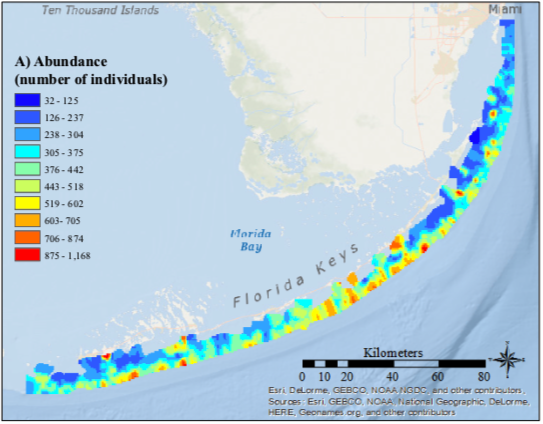
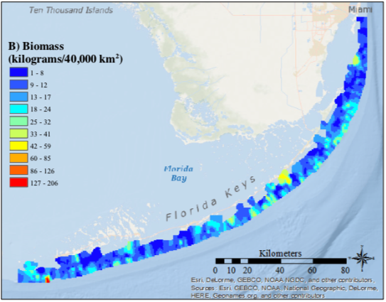
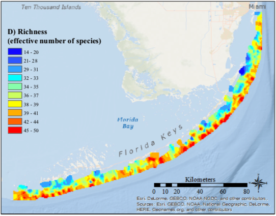
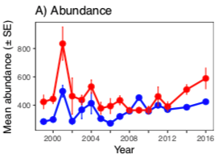
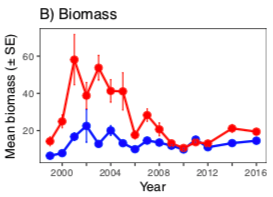
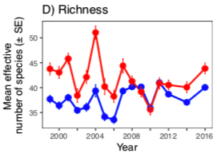

```{r setup, include=FALSE}
library(knitr)
knitr::opts_chunk$set(echo = F, message = F, warning = F)
```

```{r}
library(tidyverse)
library(dygraphs)
library(xts)
library(lubridate)
library(glue)

csv <- "https://raw.githubusercontent.com/marinebon/info-fk/master/prep/data/rvc_exploited_species/exploited_fk_den.csv"

d <- read_csv(csv) %>% 
  mutate(
    yr_date = as_date(glue("{YEAR}-06-15")))

rvc_plot <- function(d, name, title){
  dd <- d %>% 
    filter(common_name == !!name) %>% 
    select(yr_date, density_mean, protected_status) %>% 
    spread(protected_status, density_mean, fill=0)
  
  select(dd, -yr_date) %>%
    as.xts(order.by=dd$yr_date) %>%
    dygraph(main=title) 
}
```

## Maps {.tabset}

### Abundance


### Biomass



### Richness



## Time Series {.tabset}

### Abundance



### Biomass



### Richness




## By Species {.tabset}

### Black Grouper

```{r, class.source="container-fluid full-width", fig.height=2.5}
rvc_plot(d, "Black_Grouper", "Black Grouper Density")
```

### Goliath Grouper

```{r, layout="l-screen-inset", fig.height=2.5}
rvc_plot(d, "Goliath_Grouper", "Goliath Grouper Density")
```

### Graysby

```{r, layout="l-screen-inset", fig.height=2.5}
rvc_plot(d, "Graysby", "Graysby Density")
```

### Grey Snapper

```{r, layout="l-screen-inset", fig.height=2.5}
rvc_plot(d, "Grey_Snapper", " Density")
```

### Hogfish

```{r, layout="l-screen-inset", fig.height=2.5}
rvc_plot(d, "Hogfish", "Hogfish Density")
```

### Mutton Snapper

```{r, layout="l-screen-inset", fig.height=2.5}
rvc_plot(d, "Mutton_Snapper", "Mutton Snapper Density")
```

### Nassau Grouper

```{r, layout="l-screen-inset", fig.height=2.5}
rvc_plot(d, "Nassau_Grouper", "Nassau Grouper Density")
```

### Red Grouper

```{r, layout="l-screen-inset", fig.height=2.5}
rvc_plot(d, "Red_Grouper", "Red Grouper Density")
```

### Yellowtail Snapper

```{r, layout="l-screen-inset", fig.height=2.5}
rvc_plot(d, "Yellowtail_Snapper", "Yellowtail Snapper Density")
```

## References

The maps and timeseries are from:

Hepner, Megan E., "Reef Fish Biodiversity in the Florida Keys National Marine Sanctuary" (2017). Graduate Theses and Dissertations. https://scholarcommons.usf.edu/etd/7408

See Also:

* [jeremiaheb/rvc: New implementation of the rvcstats package, which produces summary statistics for the South Florida Reef Visual Census](https://github.com/jeremiaheb/rvc)
* [Marine Biodiversity Observation Network: Florida Keys Reef Fish Visual Census: Loop Current flow variability impacts on species diversity](https://mbon.ioos.us/#default-data/6.1)
* [Marine Biodiversity Observation Network: Florida Keys Reef Fish Visual Census: Florida Keys Reef Fish Visual Census: Biodiversity Indexing](https://mbon.ioos.us/#metadata/53cb8d58-ae4d-43e1-aea3-640db9491db2/875de156-d933-4373-bb09-486c25eccfb2)


